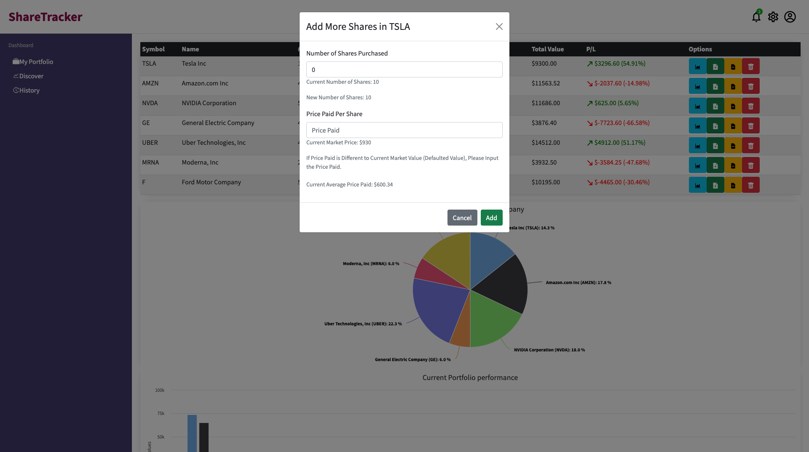
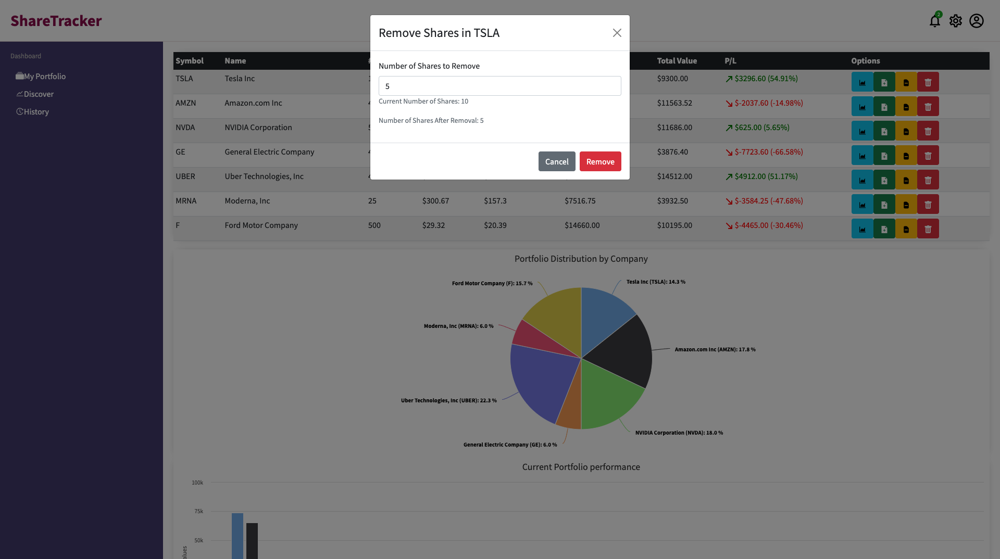

# Portfolio Tracker
The Portfolio Tracker app allows a user to track their shareholdings performance and total portfolio value in real-time. The "Discover" page allows a user to select a number of stocks provided by an external API, real-time data comes from the NASDAQ stock exchange. User is able to compare different stocks, add them to their portfolio and track the total portfolio value in real-time which is displayed on "My Portfolio" page.

Built using MongoDB, Express, React, Node.

Portfolio / Home Page

Discover Page

## Project brief
A local trader has come to you with a portfolio of shares. She wants to be able to analyse it more effectively. She has a small sample data set to give you and would like you to build a Minimum Viable Product that uses the data to display her portfolio so that she can make better decisions.

## The project is built using:
* Javascript (Node)
* React
* Express
* MongoDB
* HTML / CSS
* Additional libraries used: HighCharts, Bootstrap
The application is using Financial Modeling Prep API as a source of stock data: https://financialmodelingprep.com/developer/docs/
